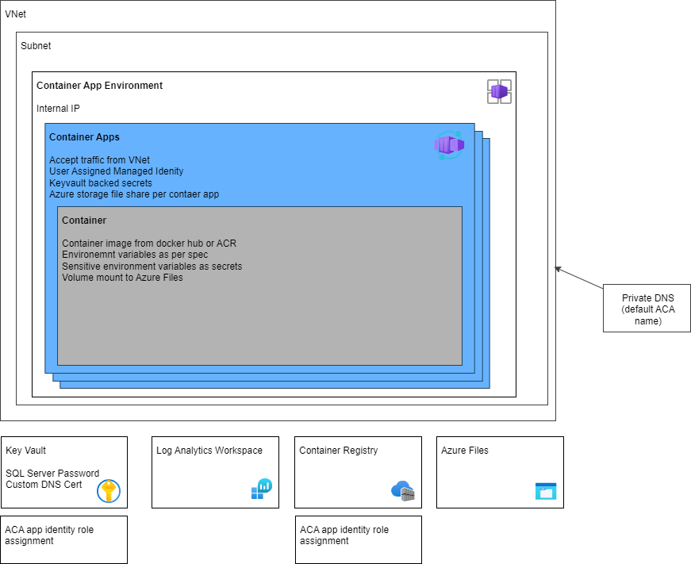

# Bicep Templates for Azure Container Apps

This repository contains Bicep templates to deploy Azure Container Apps infrastructure and services. The templates are divided into two directories:

* `infra` - contains the Bicep templates to deploy an Azure Container Apps Environment and supporting services. Use these templates if you don't already have an existing container apps environment.
* `apps` - contains the Bicep templates to deploy container app services. Use these templates to deploy your container app services into an existing container apps environment.

## Infra

Infrastructure deployed to host Azure Container Apps. Deploy only if you don't already have an existing container apps environment (e.g. the [Azure Container Apps Landing Zone Accelerator](https://github.com/Azure/aca-landing-zone-accelerator)):



The template deploys the following services:

* Log Analytics Workspace
* Azure Key Vault using the Azure RBAC permissions model. You will have to make yourself a Secrets adminstrator if you would like view and update secrets 
* Azure Container Registry
* Azure Container App Environment
* Private DNS Zone for default ACA environment domain if the environment is deployed in internal mode, and optionally for custom domain
* Role assignments for the Azure Container App Environment identity to the Azure Container Registry and the Azure Key Vault

To deploy the infrastructure:

* Create a resource group:

```bash
az group create --name containerAppResourceGroup --location australiaeast
```
* Change to the `templates\infra`  directory 
* Create a copy of the `sample_params.bicepparam` file and update the parameters accordingly.
* Run the following command to deploy the infrastructure:

```bash
az deployment group create --resource-group containerAppResourceGroup --parameters ./your_params.bicepparam
```

## Apps

The Apps templates deploy container apps into container app environments, including configuration for environment variables and volume mounts. The templates can handle either container images from a public registry (docker hub), or from an Azure Container Registry.  

To deploy your apps:

* Change to the `templates\apps`  directory 
* Create a copy of the `sample_apps.bicepparam` file and update the parameters accordingly. The only required parameters are the `aca_env_name` and `service_params` object (more on this below). You may also need to specify the following parameters, depending on your requirements:
  * `container_registry_name` - if your images are in an ACR
  * `key_vault_name` - if you have specificed secret environment variables that need to be stored in a Key Vault
  * `files_storage_account_name` - if you have volume mounts
* Run the following command to deploy the infrastructure:

```bash
az deployment group create --resource-group containerAppResourceGroup --parameters ./your_apps.bicepparam
```

### Service Params Object

The app deployment template contains a `service_params` object that is used to configure the Container Apps. The object is a list of service configuration objects, one for each service. 

#### Minimum configuration:

```bicep
{
  name: 'aca-service-1'
  container_image: 'davidxw/webtest:latest'
}
```

#### Full configuration:
```bicep
{
  name: 'aca-service-1'
  ingress_external: true
  target_port: 80
  workload_profile: 'Consumption'
  container_name: 'webtest'
  container_image: 'containerRegistry.azurecr.io/davidxw/webtest:latest'
  envs: {
    SQL_SERVER: 'sql_server'
    SQL_DATABASE: 'sql_database'
    SQL_USER: 'sql_user'
  }
  envs_secret: {
    SQL_PASSWORD: 'secret string'
  }
  volume_mounts: [
  {
      mountPath: '/app/logs'
      subPath: 'logs'
    }
  ]
}
```
#### Defaults:

| Parameter | Default |
| --- | --- |
| `is_ingress_external` | `true` |
| `target_port` | `80` |
| `workload_profile` | `Consumption` |
| `container_name` | The service name |

#### Notes:

* The only required propperties are `name` and `container_image`.
* The template currently assumes that all containers have ingress enabled - there is currently no option to disable ingress.
* If your container images is stored in ACR, you must included the registry name in the `container_image` parameter (e.g. `containerRegistry.azurecr.io/davidxw/webtest:latest`).
* `envs`, `envs_secret`, and `volume_mounts` are optional. If `envs_secret` is specified, then a `key_vault_name` parameter must also be specified. If `volume_mounts` is specified, then a `files_storage_account_name` parameter must also be specified. If you are using a public image then only the path and tag are required (e.g. `davidxw/webtest:latest`).
* The deployment creates an Azure Files Share for each service, and mounts all the specified volume mounts for a service to that share. `subPath` is optional, and if not specified the volume mount will be mounted to the root of the share.
* All items in `envs_secret` are stored in the Azure Key Vault, with the env name as the secret name. A container app secret is create for each (referencing the Key Vault secret), and the container app environment variable references the Container App secret.
* Currently only one container per service is supported.

### Copying public images into your ACR

If you would like to copy public images into your ACR you can use the command below:

```bash
az acr import  --name dssContainerRegistry --source docker.io/davidxw/webtest:latest  --image davidxw/webtest:latest
```